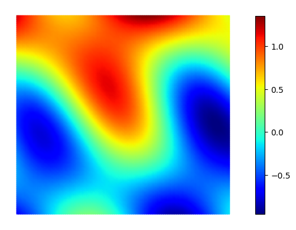
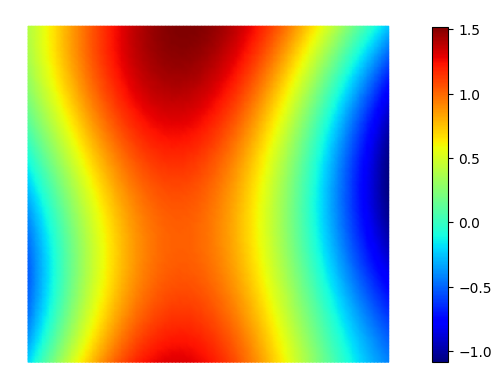
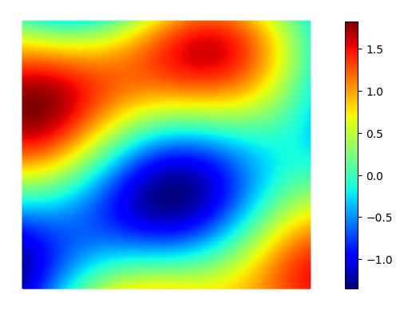
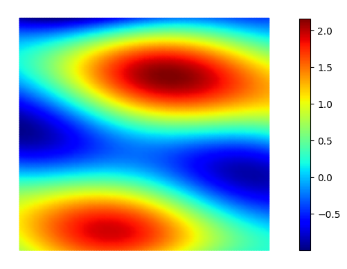
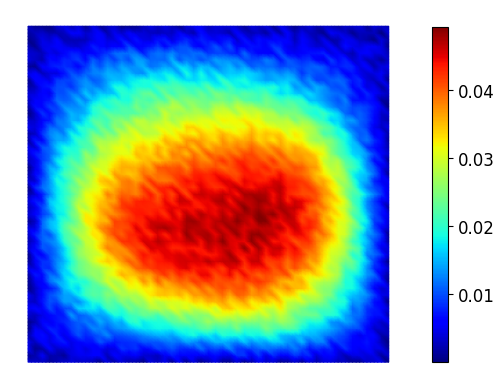
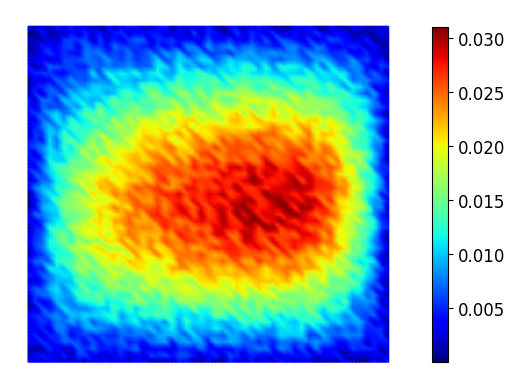
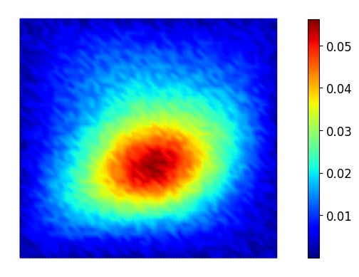
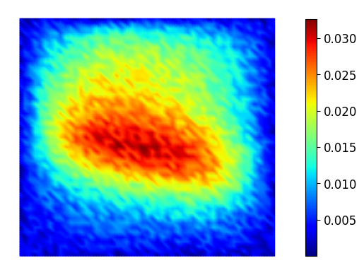

# Physics-driven machine learning models

[](https://sandbox.zenodo.org/badge/latestdoi/596195530)

[](https://github.com/dwyl/esta/issues)


This package provides the base implementation for implementing, evaluating, and training physics-driven machine learning models in a highly productive way using [PyTorch](https://pytorch.org/) and [Firedrake](https://www.firedrakeproject.org/). This repository contains the official implementation of the heat conductivity example in "[Physics-driven machine learning models coupling PyTorch and Firedrake](https://arxiv.org/abs/2303.06871)", accepted at _ICLR 2023 (Physics for Machine Learning workshop)_. Complex simulations coupling machine learning models implemented in PyTorch and partial differential equations implemented in Firedrake can seamlessly be evaluated and differentiated while only requiring trivial changes to existing code (cf. [paper](https://arxiv.org/abs/2303.06871)).


## Table of Contents
* [Setup](#setup)
* [Generate dataset](#generate-dataset)
* [Training](#training)
* [Evaluation](#evaluation)
* [Reporting bugs](#reporting-bugs)
* [Contributing](#contributing)
* [Citation](#citation)

## Setup

This work relies on the Firedrake finite element system and on PyTorch, which both need to be installed.

### Installing Firedrake

[Firedrake](https://www.firedrakeproject.org/) can be installed via its installation script, which you can download and run via:

```install_firedrake
  curl -O https://raw.githubusercontent.com/firedrakeproject/firedrake/master/scripts/firedrake-install
  python3 firedrake-install --package-branch firedrake pytorch_coupling
```

Finally, you will need to activate the Firedrake virtual environment:

```activate_venv
source firedrake/bin/activate
```

For more details about installing Firedrake: see [here](https://www.firedrakeproject.org/download.html).

### Installing PyTorch

Then, you need to install [PyTorch](https://pytorch.org/) (see [here](https://pytorch.org/get-started/locally/#start-locally)). Make sure to have your Firedrake virtual environment activated when you install it.

### Installing physics-driven-ml

Finally, you need to install the physics-driven-ml package (within you Firedrake virtual environment) via:

```install_physics_driven_ml
git clone https://github.com/nbouziani/physics-driven-ml.git
pip install -e physics-driven-ml
```

### Testing installation

We recommend that you run the test suite after installation to check that your setup is fully functional. Activate the virtual environment as above and then run:

```install_firedrake_external_operator_branches
cd physics_driven_ml
pytest tests
```

## Generate dataset

This package provides the base implementation for generating PDE-based inverse problems dataset for an arbitrary forward problem $\mathcal{F}$. The current implementation enables to generate pairs $\lbrace\kappa_{i}, u_{i}^{obs}\rbrace_{1 \le i\le n}$ where $\kappa_{i}$ is the parameter of interest (control) and $u_{i}^{obs}$ refers to the observed data, which are obtained by computing the forward problem for a given $\kappa_{i}$ and adding noise to the forward solution. In other words, we have:

$$u^{obs}_{i} = \mathcal{F}(\kappa_{i}) + \varepsilon \quad \forall i \in [|1, n|]$$

where $\varepsilon$ is noise, and $\mathcal{F}$ is the forward operator that returns the solution of the correponding PDE for a given control $\kappa_{i}$.

For example, the following line will generate 500 training samples and 50 test samples for the heat time-independent forward problem, and store the resulting dataset named "heat_conductivity_500" into `data/datasets` folder.

```generate_data
cd physics_driven_ml/dataset_processing
python generate_data.py --forward heat --ntrain 500 --ntest 50 --dataset_name heat_conductivity_500
```

You can specify your own custom PDE-based forward problem and/or custom noise perturbation by providing the corresponding callables to the [generate_data](https://github.com/nbouziani/physics-driven-ml/blob/main/physics_driven_ml/dataset_processing/generate_data.py#L30) function.

The dataset used in the paper for the heat conductivity example is provided and can be found in [data/datasets/heat_conductivity_paper](https://github.com/nbouziani/physics-driven-ml/tree/main/data/datasets/heat_conductivity_paper). Here are some samples from the test set:

$$\kappa$$
<p align="center">
  
  
  
  
</p>

$$u^{obs}$$
<p align="center">
  
  
  
  
</p>


## Training

For training, we provide in [train_heat_conductivity.py](https://github.com/nbouziani/physics-driven-ml/blob/main/physics_driven_ml/training/train_heat_conductivity.py) the code for training several models (e.g. CNN or encoder-decoder) on the heat conductivity example. This training script showcases how one can train PyTorch models with PDE components implemented in Firedrake. This example can easily be adapted to other forward problems by simply changing the PDE problem definition.

Several evaluation metrics can be used for evaluation such as L2 or H1. For the paper experiments, we used a L2-relative error averaged across the test samples. The best performing model(s) with respect to the given evaluation metric will be saved in `data/saved_models` throughout the epochs. For example, the following command trains the model for 150 epochs on the heat conductivity dataset used in the paper using an averaged L2-relative error.

```training
cd physics_driven_ml/training
python train_heat_conductivity.py --dataset heat_conductivity_paper --epochs 150 --model_dir cnn_heat_conductivity --evaluation_metric avg_rel
```

## Evaluation

For evaluation, we provide in [evaluate.py](https://github.com/nbouziani/physics-driven-ml/blob/main/physics_driven_ml/evaluation/evaluate.py) the implementation for evaluating PyTorch machine learning models on arbitrarily defined PDE-based datasets while leveraging the full armoury of norms suited to PDE-based problems provided by Firedrake such as: L2, H1, Hdiv, or Hcurl. For inference, we need to specify the model directory as well as the model version corresponding to the saved model checkpoint of interest.

For example, the following command evaluates the model saved in `data/saved_models/cnn_heat_conductivity` corresponding to the checkpoint saved at the 76th epoch (named `heat_conductivity_paper-epoch-76-error_0.14`) using the L2 norm:

```evaluation
cd physics_driven_ml/evaluation
python evaluate.py --dataset heat_conductivity_paper --model_dir cnn_heat_conductivity --model_version heat_conductivity_paper-epoch-76-error_0.14 --evaluation_metric L2
```

Model checkpoints are saved during training and follow the structure `<dataset_name>-epoch-<epoch_num>-error_<best_error>`. For sake of simplicity, one might want to consider adding an experiment tracker file to label the model checkpoints of interest.

## Reporting bugs

If you found a bug, create an [issue](https://github.com/nbouziani/physics-driven-ml/issues/new). Please try to include as much information as you can in the issue. In particular, adding a minimal reproducible example is incredibly useful.

## Contributing

Contributions are much appreciated and can be done via pull requests (cf. [contributing to projects](https://docs.github.com/en/get-started/quickstart/contributing-to-projects)). More specifically, you need to:

1. Fork and clone the project.

2. Make your changes and add tests when necessary in `tests`.

3. Make sure all tests pass by running within your virtual environment (cf. [setup section](#setup)):

```
pytest tests
```

In addition, make sure your changes comply with `flake8` formatting.

4. Push to your fork and [submit a pull request](https://github.com/nbouziani/physics-driven-ml/pulls).


## Citation

If you found this work to be useful, then please cite: ([arXiv paper](https://arxiv.org/abs/2303.06871))

```bibtex
@inproceedings{bouziani_physics-driven_2023,
	title = {Physics-driven machine learning models coupling {PyTorch} and {Firedrake}},
	author = {Bouziani, Nacime and Ham, David A.},
	booktitle = {{ICLR} 2023 {Workshop} on {Physics} for {Machine} {Learning}},
	year = {2023},
	doi = {10.48550/arXiv.2303.06871}
}
```
